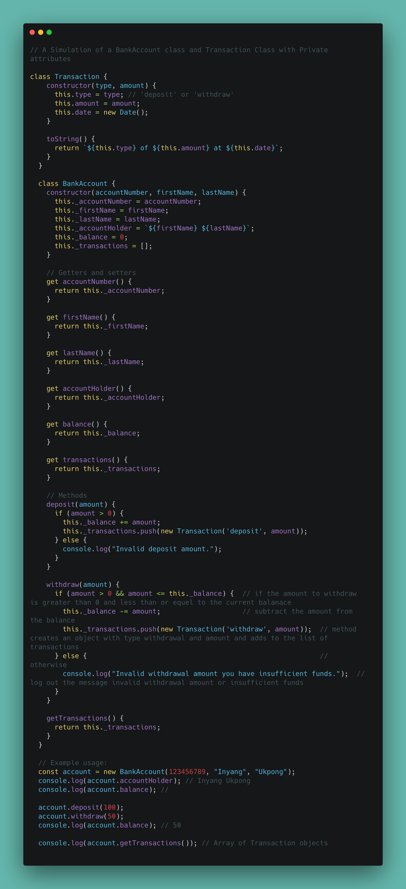
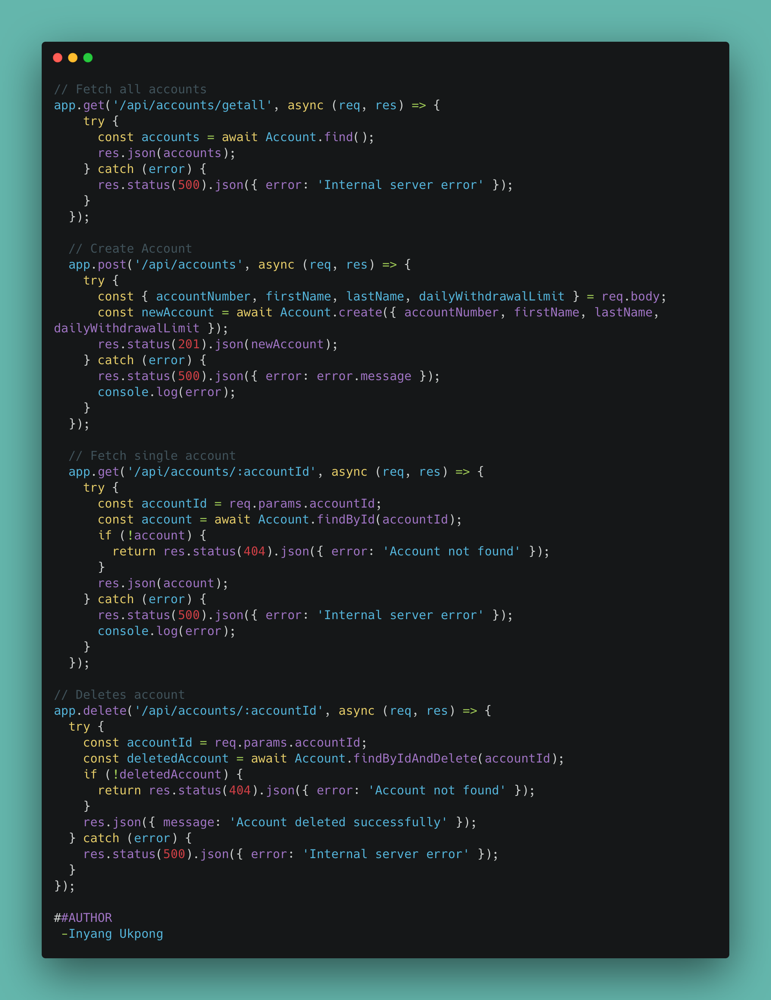
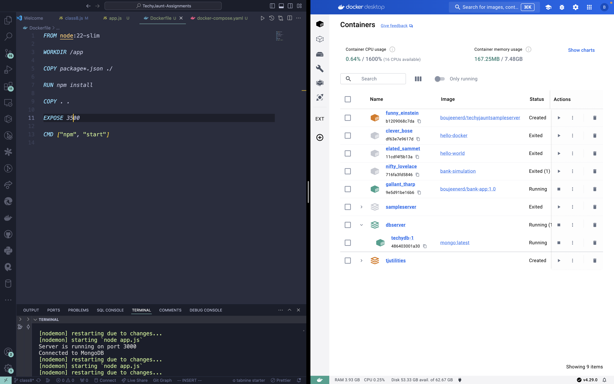

# Simulation Bank Account System

## This simulation is an implementation of a Bank Account System

The Transaction class represents a single transaction with attributes like type (deposit or withdraw), amount, and date.
The BankAccount class represents a bank account with attributes like account number, first name, last name, account holder's full name, balance, and transactions.
Getter methods are provided to access the private attributes.
Methods like:

1. deposit
2. withdraw
3. getTransactions
are provided to perform actions on the account and retrieve transaction history.



## Additional Features (APIs Implementation)

1. Fetch all accounts
2. Create Account
3. Fetch Single Account
4. Delete Account
5. Update Account
6. Fetch All Transactions for an Account
7. Daily Withdrawal Limit
8. Withdrawal
9. Deposit
10. 

``` js
app.put('/api/accounts/:accountId', async (req, res) => {
  try {
    const accountId = req.params.accountId;
    const { accountNumber, firstName, lastName, dailyWithdrawalLimit } = req.body;
    const updatedAccount = await Account.findByIdAndUpdate(accountId, { accountNumber, firstName, lastName, dailyWithdrawalLimit }, { new: true });
    if (!updatedAccount) {
      return res.status(404).json({ error: 'Account not found' });
    }
    res.json(updatedAccount);
  } catch (error) {
    res.status(500).json({ error: 'Internal server error' });
  }
});

// Fetches all transactions for an account
app.get('/api/accounts/:accountId/transactions', async (req, res) => {
  try {
        const accountId = req.params.accountId;
        

        const account = await Account.findById(accountId);
        if (!account) {
            return res.status(404).json({ error: 'Account not found' });
        }
    
        const transactions = account.transactions;
    res.status(200).json({transactions});
  } catch (error) {
    res.status(500).json({ error: 'Internal server error' });
  }
});
```

## Technologies Used

1. **Programming Languages**: *Javascript*
2. **Backend**: *Node.js*!
3. **Framework**: *Express.js*!
4. **Object Data Model**: *Mongoose for MongoDB*!

## Tools Used

1. **DB Client**: *TablePlus*
2. **Container**: *Docker*
3. **API Testing and Debugging**: *Insomnia*
4. **Code Editor**: *VScode*



**AUTHOR:** "*Inyang Ukpong*"
